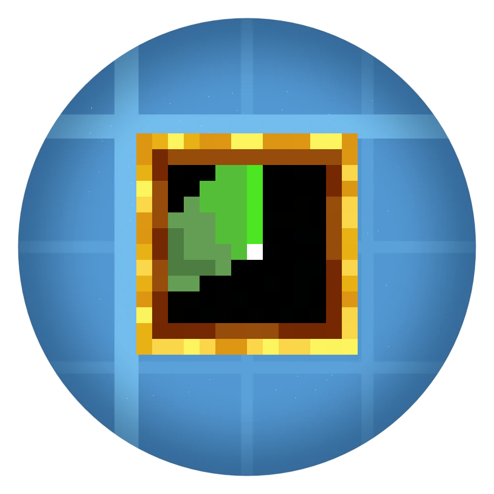

# Create Radar: Mobile Radars

[](LICENSE)
[](https://www.minecraft.net/)
[](https://neoforged.net/)

NeoForge add-on for **Minecraft 1.21.1** that extends **[Create: Radars](https://github.com/Arsenalists-of-Create/Create-Radar)** with portable radar tools: a **radar tablet** with a HUD and **radar goggles** with tactical optics, aim modes, and zoom.

Requires the [core Create Radars mod](https://github.com/Arsenalists-of-Create/Create-Radar) (download also on [CurseForge](https://www.curseforge.com/minecraft/mc-mods/create-radars)).


Both items appear in the **Create: Radars** creative tab (alongside the other radar blocks).

## Features

### Radar tablet
- Pair at a **network trunk** (Network Filterer) — right-click the block
- **Right-click in the air** opens the handheld radar display with live tracks (range is configurable)
- Select targets the same way as on a stationary monitor

### Radar goggles
- Also paired at a network trunk
- **Right-click**: deploy optics in front of your eyes / while deployed, **clear the radar target**
- **Shift + right-click**: **stow** optics (when deployed) or **clear pairing** (when stowed)
- CRT overlay, crosshair with **Snap / Assist / Manual**, **Z** for zoom
- **Left-click** locks the target under the crosshair (including radar raycast through blocks)
- Night vision while holding the paired, deployed goggles in your hand

## Dependencies

| Mod | Required |
|-----|----------|
| NeoForge | Yes |
| Minecraft 1.21.1 | Yes |
| Create | Yes (6.0.10+) |
| Create: Radars | Yes (0.4.4+) |
| Create Big Cannons | Yes (5.11.2+) |
| Valkyrien Skies | Optional |
| Sable | Optional |

For local development, see `lib/README.md` (local CBC JAR).

## Controls (goggles)

| Input | Action |
|-------|--------|
| Right-click (stowed) | Deploy optics |
| Right-click (deployed) | Clear radar target |
| Shift + right-click (deployed) | Stow optics |
| Shift + right-click (stowed) | Clear pairing |
| **G** | Cycle aim mode (Manual / Snap / Assist) |
| **Z** (hold) | Zoom |
| Left-click | Lock target under crosshair |

Keys can be rebound under *Controls → Create Radar: Mobile Radars*.

## Configuration

Server: `serverconfig/create_radar_mobile_radars-server.toml`

- `portableMaxRangeBlocks` — max distance to the radar antenna (default: **128** blocks)

## Development

1. Place API JARs in **`lib/`** as described in [`lib/README.md`](lib/README.md).
2. **Java 21**
3. Build and run:

```bash
./gradlew build
./gradlew runClient
```

Artifact: `build/libs/create_radar_mobile_radars-<version>.jar`

## Contributing

See [CONTRIBUTING.md](CONTRIBUTING.md). Please use the [issue templates](.github/ISSUE_TEMPLATE/) for bugs, features, and compatibility reports.

For **security-sensitive** reports, use the [Create-Radar security advisories](https://github.com/Arsenalists-of-Create/Create-Radar/security/advisories/new) on the core repository — do not open a public issue.

## License

This project is licensed under the **MIT License** — see [LICENSE](LICENSE).

*Create*, *Create: Radars*, *Create Big Cannons*, and *Minecraft* are not affiliated with this repository.